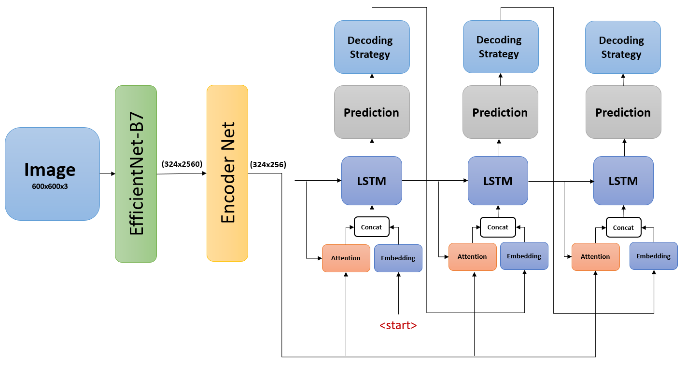
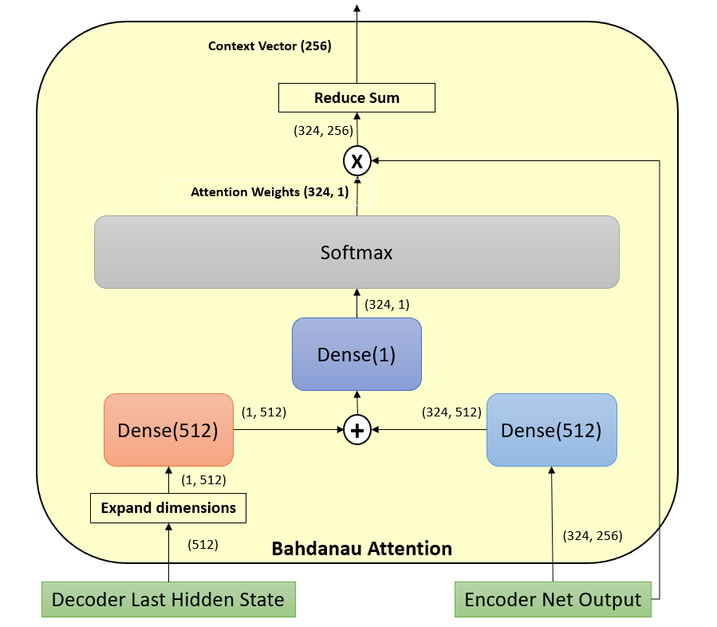
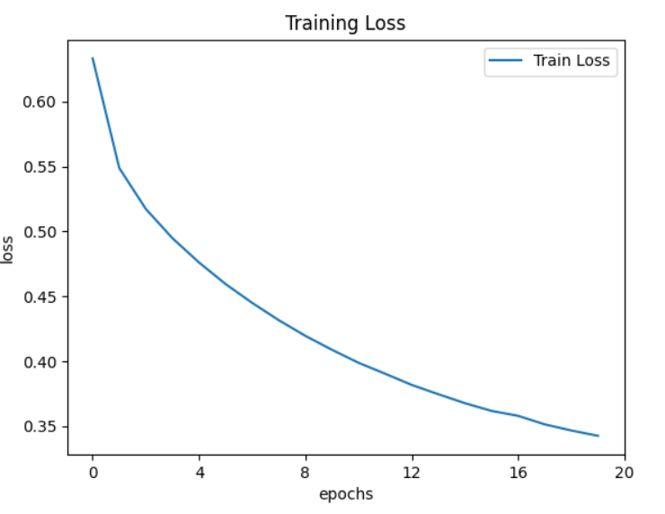
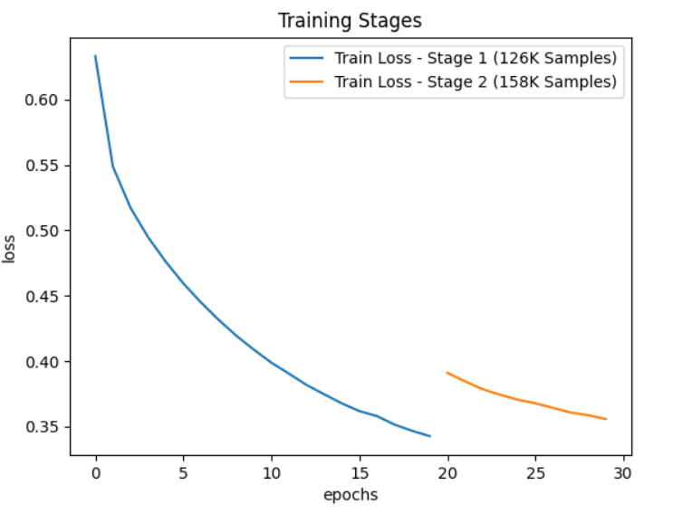
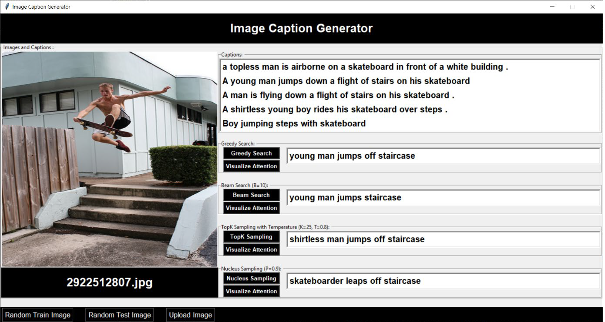
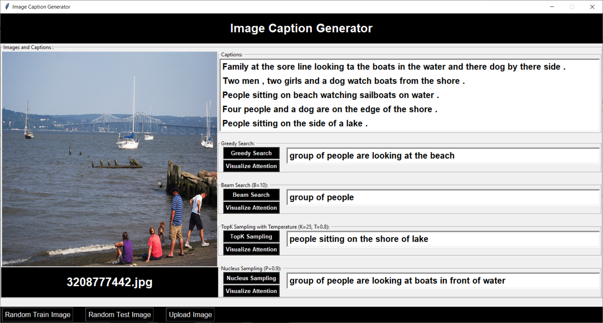
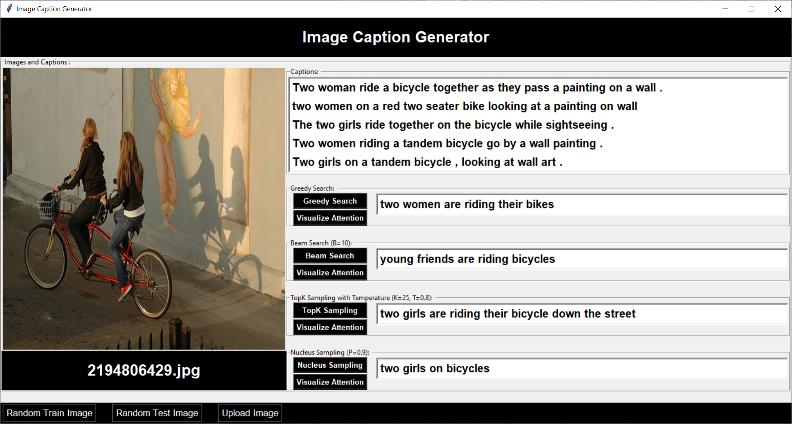
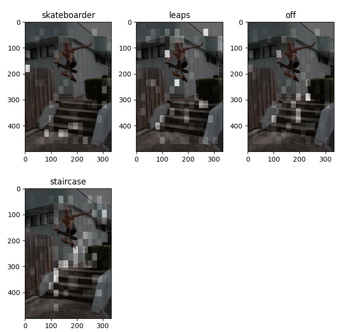
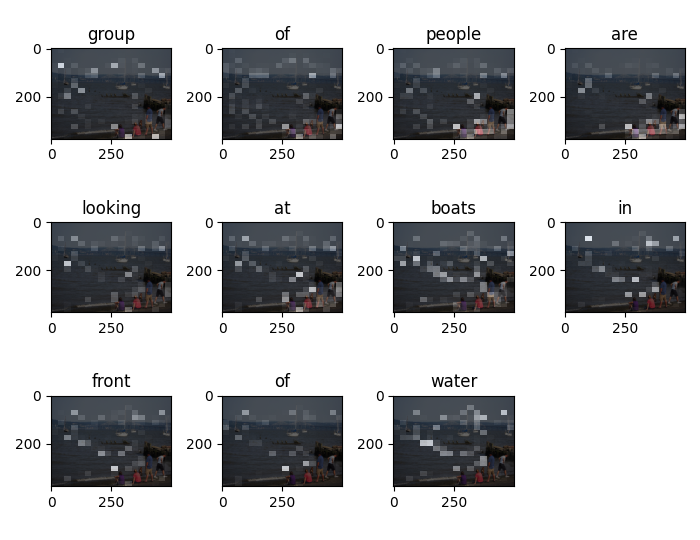

#  Building an Attention-Based Image Caption Generator
The rapid development of artificial intelligence in the recent years has provided the opportunity for the emergence of researches that form an intersection of some separate fields, and the automatic generation of phrases describing the input images is one of the most important such researches, which combines the tasks required of computer vision in addition to the tasks of natural language processing.

This type of systems requires the ability of understanding the semantics of images, and creating sentences with a correct structure that express these semantics.

## Encoder(CNN)-Decoder(RNN) Architecture:

We built our system using two types of Artificial Neural Networks: a **Convolutional Neural Network (CNN)** in order to understand the semantics of the image and extract its features – a **Recurrent Neural Network (RNN)** to express the extracted features in short terms.

## Transfer Learning:

In order to increase the accuracy and robustness of our system, Transfer Learning has been used to transfer the knowledge possessed by the state-of-the-art **EfficientNet-B7**, which has made amazing achievements in the field of understanding and classifying images.

## Our System Architecture:

## Attention Mechanism (Soft Attention):

As an attempt to simulate one of the most important characteristics of the human visual system, the attention technique was used, which provides a dynamic mechanism that allows each part of the image to oracle a certain meaning to the system:

## Flickr30k Dataset:

[Download Flickr30k](https://www.kaggle.com/hsankesara/flickr-image-dataset).

Flickr30K dataset was used to train our system, where the error was estimated at about **34%** after the end of the first stage of the training process:

## The first stage of the training process:

## Multiple Decoding Strategies:

After that, we tested our system using different decoding strategies:
- Greedy Search.
- Beam Search.
- Sampling with Temperature.
- TopK Sampling.
- Nucleus Sampling.

## The second stage of the training process:

In order to enhance the robustness and accuracy of our system, a second stage of the training process was launched, in which the system was trained on a larger set of samples, and the error after the end of that stage was estimated at approximately **35%**:

## Graphical User Interface:

Finally, we have developed a GUI which allows you to upload images, and generate their corresponding captions with the use of different decoding strategies:

## Visualize Attention:

We have provided a simple mechanism that allows the user to observe the attention technique that the system uses to focus its attention on different parts of the image as it generates each word of the resulting caption:

